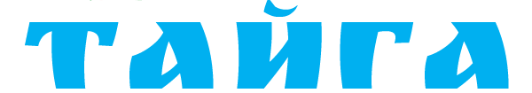

# ✅ Логотип logo3.png + текст установлен!

## 🎉 Что получилось:

```
┌────────────────────────┐
│    [logo3.png]         │  ← Картинка логотипа
│  СТРОИТЕЛЬНАЯ КОМПАНИЯ │  ← Голубой текст #00B0F0
└────────────────────────┘
```

**Идеальная комбинация:** Картинка + текст!

---

## ✅ Применено на всех страницах:

- ✅ index.html (главная)
- ✅ catalog.html (каталог)
- ✅ contacts.html (контакты)
- ✅ faq.html (вопросы)

**В двух местах:**
- Шапка сайта (header)
- Подвал сайта (footer)

---

## 🎨 Настройки отображения:

### Картинка (logo3.png):
- **Высота:** 50px (десктоп), 40px (мобильный)
- **Ширина:** автоматическая
- **Качество:** сохраняет пропорции

### Текст ("строительная компания"):
- **Размер:** 10px
- **Цвет:** #00B0F0 (голубой)
- **Стиль:** заглавные буквы, жирный
- **Расстояние между буквами:** 1.5px

### В футере:
- Картинка: белая (фильтр инверсии)
- Текст: белый
- Прозрачность: 90%

---

## 📱 Адаптивность:

| Устройство | Логотип | Текст |
|-----------|---------|-------|
| Десктоп | 50px | 10px |
| Планшет | 50px | 10px |
| Мобильный | 40px | 8px |

Всё автоматически уменьшается на маленьких экранах!

---

## 🎯 Преимущества этого решения:

✅ **Чёткий логотип** - картинка высокого качества  
✅ **Читаемый текст** - голубой цвет бренда  
✅ **Информативно** - сразу понятно, что это за компания  
✅ **Профессионально** - комбинация картинки и текста  
✅ **Адаптивно** - работает на всех устройствах  
✅ **Кликабельно** - весь блок ведёт на главную  

---

## 🔧 Если нужно изменить:

### Размер логотипа:
Откройте `assets/css/styles.css`, найдите:
```css
.logo-image {
    height: 50px;  ← измените на нужный
}
```

### Размер текста:
```css
.logo-subtitle {
    font-size: 10px;  ← измените
}
```

### Цвет текста:
```css
.logo-subtitle {
    color: #00B0F0;  ← измените на другой
}
```

**Варианты цветов:**
- Текущий голубой: `#00B0F0`
- Тёмно-синий: `#0066CC`
- Серый: `#6b7280`
- Чёрный: `#111827`

---

## 📐 Структура логотипа:

```html
<div class="logo-wrapper">
    
    <span class="logo-subtitle">строительная компания</span>
</div>
```

**logo-wrapper** - контейнер, выстраивает элементы в колонку  
**logo-image** - картинка логотипа  
**logo-subtitle** - текст под логотипом  

---

## 💡 Советы:

### Если логотип размытый:
1. Проверьте оригинальный logo3.png
2. Используйте изображение в 2x размере (100px для отображения 50px)
3. Лучше всего - конвертируйте в SVG формат

### Если текст плохо видно:
1. Увеличьте размер шрифта (12px вместо 10px)
2. Сделайте жирнее (font-weight: 700)
3. Измените цвет на более тёмный

---

## 🚀 Проверка:

**Откройте сайт:**
1. Двойной клик на `index.html`
2. Нажмите **Ctrl+F5** (жёсткое обновление)

**Что увидите:**
- ✅ Логотип logo3.png в шапке
- ✅ Под ним текст "СТРОИТЕЛЬНАЯ КОМПАНИЯ" голубым
- ✅ В футере всё белое
- ✅ На мобильном всё уменьшается

---

## 🔄 История изменений:

1. ❌ Был текстовый логотип "TAIGA" зелёный
2. ❌ Заменили на "Тайга" голубой #00B0F0
3. ❌ Поставили logo_taiga.png (размытый)
4. ✅ Поставили logo2.png
5. ✅ **Сейчас: logo3.png + текст под ним** ⭐

---

## ✨ Итог:

**Текущий логотип:**
- 🖼️ Картинка logo3.png (50px)
- 📝 Текст "строительная компания" голубым (#00B0F0)
- 📱 Адаптивный
- 🎯 Профессиональный вид

**Это идеальное сочетание читаемости и брендинга!** 🎉

---

## 📂 Файлы:

- Логотип: `E:\Island\projects\taiga\images\logo3.png`
- Стили: `E:\Island\projects\taiga\assets\css\styles.css`

**Готово к использованию!** 🚀


